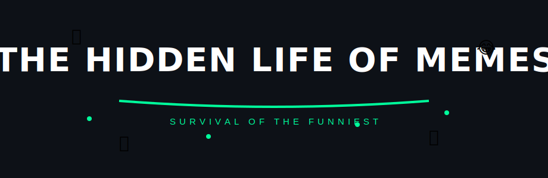
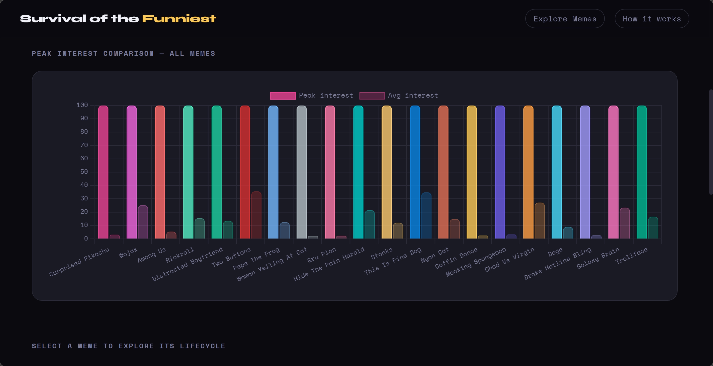
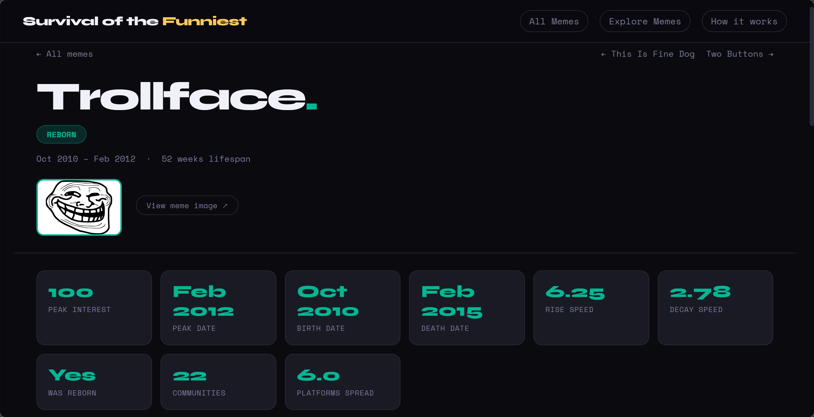
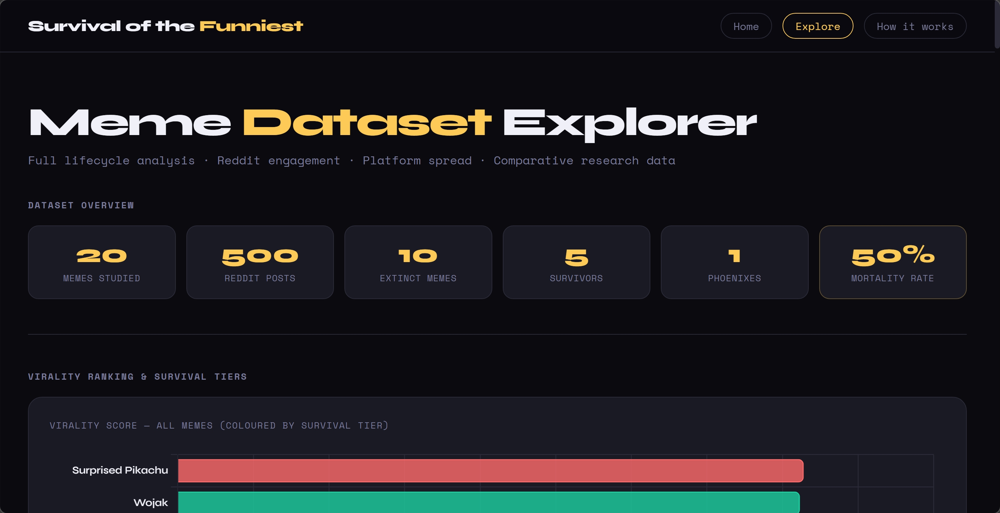
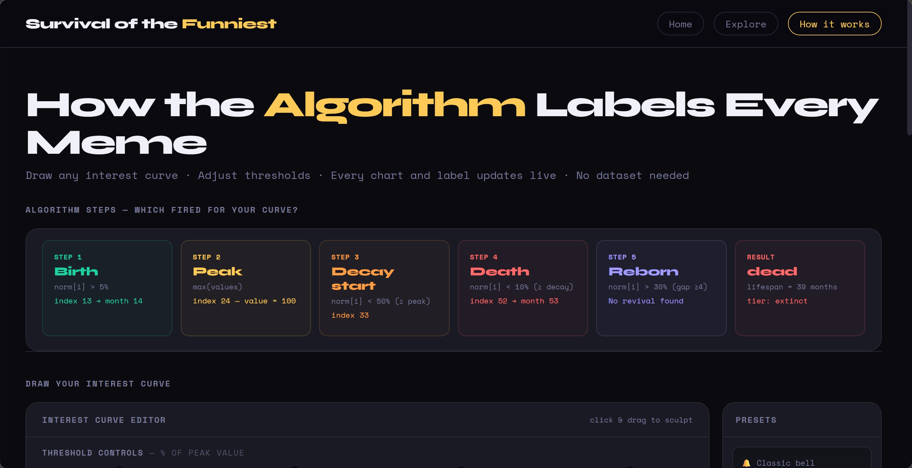
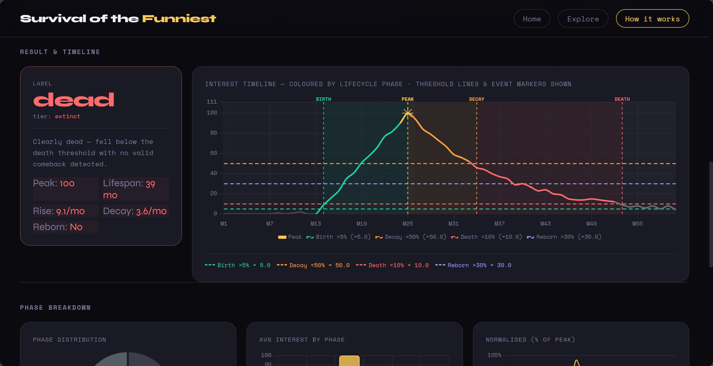

<p align="center">

</p>

## Overview

Memes are not just jokes — they behave like **digital organisms**.
They are **born**, **spread**, **evolve**, **decline**, and sometimes **reappear years later**.

🌐 **Live Demo:** [abineshabee.pythonanywhere.com](https://abineshabee.pythonanywhere.com)

This project explores the **evolutionary lifecycle of internet memes** using data-driven analysis.
By combining multiple internet data sources, we reconstruct how memes grow, peak, decay, and survive over time — week by week, from 2010 to 2024.


The central research question:

> **Why do some memes survive for years while others disappear in weeks?**

The project models meme behaviour using a lifecycle algorithm inspired by **evolutionary biology and epidemiology**.

---

## Research Objectives

- How does a meme **start spreading**?
- What determines a meme's **virality peak**?
- Why do some memes **die quickly** while others survive for years?
- Can memes **resurrect after dying**?
- How do **platforms influence meme evolution**?
- How do memes **mutate and adapt** across communities?

---

## Data Sources

To reconstruct the full lifecycle of each meme, the project combines five independent data sources.

### Google Trends
Provides **weekly search interest data from 2010 to 2024**.
This is the primary timeline backbone of the entire project.
Each meme's interest is measured on a scale of 0–100 relative to its own peak.

### Know Your Meme
Provides structured metadata including origin year, origin platform, current status (active/dead/overdone), and historical platform spread.

### Reddit Public API
Collects engagement data without authentication — post scores, comment counts, subreddit spread, and post timestamps across r/memes, r/dankmemes, r/AdviceAnimals, r/me_irl, and r/funny.

### Wayback Machine (CDX API)
Counts archived web snapshots of each meme's Know Your Meme page per year.
This acts as a proxy for historical internet discussion volume, even after a meme fades from active platforms — enabling recovery of data about memes that are already dead.

### Wikipedia
Checks whether a meme has a dedicated Wikipedia article.
Used as a **cultural permanence signal** — Wikipedia presence indicates the meme crossed from internet subculture into documented cultural history.

---

## Dataset

The dataset is divided into three files.

### meme_lifecycle_dataset.csv
One row per meme with **56 computed attributes** including birth date, peak date, death date, lifecycle label, survival tier, virality score, adaptability score, platform spread count, lifespan in weeks, rise speed, decay speed, reborn status, Wikipedia presence, and Wayback Machine activity history.

### meme_weekly_trends.csv
**3,600 rows** of weekly Google Trends data — one row per meme per week from January 2010 to December 2024.
Each row contains the raw interest value (0–100), the normalized value (0–1 relative to peak), and the lifecycle phase label for that week.
Used for timeline visualization, lifecycle phase detection, and chart generation.

### meme_reddit_posts.csv
**500 individual Reddit post records** across all 20 memes.
Each record contains the post title, date, subreddit, score, comment count, awards, and URL.
Used for Reddit engagement analysis and community spread research.

---

## Data Collection Script

All data is collected using a single Python script:

```
meme_collector.py
```

The script automatically collects from all five sources and generates the three output files.

Key features:

- Direct Google Trends API requests — no pytrends dependency
- Two-step API flow: explore endpoint → multiline data endpoint
- Automatic 429 rate-limit handling with exponential backoff (15s → 30s → 60s → 120s)
- Per-source error isolation — a failed source does not stop the collection
- NaN-safe data cleaning throughout
- Lifecycle algorithm runs at collection time and stores results in both CSVs

---

## Lifecycle Algorithm

Each meme's lifecycle is determined from its **normalized weekly interest curve** from Google Trends.
All values are normalized between 0 and 1 relative to the meme's own all-time peak.
This means every meme — large or small — is measured on the same relative scale.

The algorithm detects five checkpoints in order:

### 1. Birth
First week where normalized interest exceeds **5% of peak**.
Everything before this week is labelled `pre_birth`.

### 2. Peak
The week with the **maximum raw search interest value**.

### 3. Decay Start
First week after peak where interest drops below **50% of peak**.

### 4. Death
First week after decay start where interest falls below **10% of peak**.
If this never happens, the meme is still alive and its label is determined by lifespan length instead.

### 5. Reborn
If interest rises above **30% of peak at least 4 weeks after death**, the meme is classified as reborn.
This can only be detected if death was found first.

---

## Lifecycle Labels

Labels are assigned in strict priority order:

| Label | Condition | Example |
|---|---|---|
| `reborn` | Death found + revival above 30% | Trollface |
| `dead` | Death found, no revival | Doge, Coffin Dance, Surprised Pikachu |
| `evergreen` | No death + lifespan > 260 weeks (~5 years) | None in this dataset |
| `long_lived` | No death + lifespan 104–260 weeks (~2–5 years) | Rickroll, Wojak, This Is Fine Dog |
| `moderate` | No death + lifespan 26–104 weeks (~6 months–2 years) | Distracted Boyfriend, Galaxy Brain |
| `short_lived` | Lifespan ≤ 26 weeks | Flash memes |

---

## Survival Tiers

Each meme is also assigned a survival tier based on its combined lifecycle outcome:

| Tier | Meaning | Count |
|---|---|---|
| `phoenix` | Died and genuinely revived | 1 |
| `survivor` | Long-term active, never confirmed dead | 5 |
| `fading` | Active but declining, not yet dead | 4 |
| `extinct` | Confirmed dead, no revival | 10 |

---

## Dataset Results

The final dataset covers:

- **20 memes**
- **3,600 weekly data points** (January 2010 – December 2024)
- **500 Reddit posts** (March 2010 – March 2026)
- **0 data collection errors**
- **12 memes with Wikipedia articles**

### Key Findings

**50% mortality rate** — exactly 10 of 20 studied memes are confirmed dead.

**Only one confirmed reborn meme** — Trollface. It peaked in February 2012, died in February 2015, then spiked back to 38% of its peak in December 2015 driven by ironic revival communities.

**Virality does not guarantee survival** — Surprised Pikachu has the highest virality score (82.8) but is extinct. Trollface has the lowest virality score (45.5) but is the only phoenix in the dataset.

| Meme | Virality Score | Lifecycle Label | Survival Tier |
|---|---|---|---|
| Surprised Pikachu | 82.8 | dead | extinct |
| Wojak | 82.3 | long_lived | survivor |
| Rickroll | 80.0 | long_lived | survivor |
| Among Us | 80.0 | dead | extinct |
| Distracted Boyfriend | 78.8 | moderate | fading |
| Trollface | 45.5 | reborn | phoenix |

---

## Flask Web Application

The project includes a Flask-based research dashboard for exploring the dataset visually.

```
python app.py
```

Open in browser: `http://127.0.0.1:5000`

---

### Home Page — `/`

Displays all 20 meme cards with sparkline trend graphs, lifecycle badges, peak interest scores, and a full comparison bar chart ranking all memes by virality score.


All labels and stats are read directly from `meme_lifecycle_dataset.csv`.
Sparklines are drawn from the last 52 weeks of `meme_weekly_trends.csv`.

---

### Meme Detail Page — `/meme/<slug>`

A single reusable template handles all 20 memes.



Clicking any meme card opens its individual page showing:

- Stat cards: peak interest, peak date, birth date, death date, rise speed, decay speed, reborn status, platform spread
- Weekly Google Trends timeline with coloured lifecycle phase backgrounds
- Normalized interest curve (0–1 scale)
- Phase distribution donut chart
- Average interest by year bar chart coloured by dominant phase

---

### Explore Page — `/explore`



The research analytics dashboard. Charts include:

- Virality score ranking — all 20 memes coloured by survival tier
- Survival tier distribution donut
- Lifecycle label distribution donut
- Lifespan comparison bar (weeks from birth to death)
- Rise speed vs decay speed scatter plot grouped by tier
- Origin platform breakdown pie chart
- Platform spread count vs virality scatter
- Total Reddit score per meme
- Average Reddit comments per meme
- Monthly Reddit activity timeline

Also includes a full scrollable dataset table with all 56 lifecycle columns and links back to each meme detail page.

**Data source separation:** all internet lifecycle charts use `meme_lifecycle_dataset.csv` (Google Trends data). All Reddit engagement charts use `meme_reddit_posts.csv`. The two are never mixed.

---

### Lifecycle Algorithm Page — `/lifecycle`




A visual teaching tool explaining how the algorithm works for all 20 memes.

- Step-by-step checkpoint cards (birth, peak, decay, death, reborn)
- Label rule cards with exact thresholds and real examples
- All 20 meme cards with sparklines coloured by lifecycle phase
- Click any meme to open a detail panel showing:
  - Timeline chart with three dashed threshold lines (5% birth, 10% death, 30% reborn)
  - Coloured phase background bands
  - Phase distribution donut
  - Yearly interest bar coloured by dominant phase

---

## Meme Dataset

The 20 memes studied, with their lifecycle outcomes:

| Meme | Lifecycle | Survival Tier |
|---|---|---|
| Among Us | dead | extinct |
| Chad Vs Virgin | moderate | fading |
| Coffin Dance | dead | extinct |
| Distracted Boyfriend | moderate | fading |
| Doge | dead | extinct |
| Drake Hotline Bling | dead | extinct |
| Galaxy Brain | moderate | fading |
| Gru Plan | dead | extinct |
| Hide The Pain Harold | long_lived | survivor |
| Mocking Spongebob | dead | extinct |
| Nyan Cat | dead | extinct |
| Pepe The Frog | dead | extinct |
| Rickroll | long_lived | survivor |
| Stonks | moderate | fading |
| Surprised Pikachu | dead | extinct |
| This Is Fine Dog | long_lived | survivor |
| Trollface | reborn | phoenix |
| Two Buttons | long_lived | survivor |
| Wojak | long_lived | survivor |
| Woman Yelling At Cat | dead | extinct |

Meme images are stored in `static/memes/` as `.jpg` files named in lowercase with underscores (e.g. `distracted_boyfriend.jpg`).

---

## Project Structure

```
meme_app/
│
├── app.py                        # Flask backend — 5 routes
├── meme_collector.py             # Data collection script
│
├── meme_weekly_trends.csv        # 3,600 weekly Google Trends rows
├── meme_lifecycle_dataset.csv    # 20 memes × 56 lifecycle columns
├── meme_reddit_posts.csv         # 500 individual Reddit posts
│
├── static/
│   └── memes/                    # 20 meme images (.jpg)
│
└── templates/
    ├── index.html                # Home page + meme detail (reusable template)
    ├── explore.html              # Research analytics dashboard
    └── lifecycle_algorithm.html  # Algorithm explainer — all 20 memes
```

---

## Application Routes

| Route | Template | Description |
|---|---|---|
| `/` | index.html | Home — all 20 meme cards + comparison chart |
| `/meme/<slug>` | index.html | Detail page for any individual meme |
| `/explore` | explore.html | Research analytics dashboard |
| `/lifecycle` | lifecycle_algorithm.html | Algorithm explainer |
| `/api/meme/<slug>` | JSON | Weekly chart data for a meme |
| `/api/compare` | JSON | Virality + peak data for all memes |

---

## Navigation

All pages share the same sticky navigation bar:

**Survival of the Funniest** → Home
**Explore** → Research analytics dashboard
**How It Works** → Lifecycle algorithm explainer

---

## Technologies

| Category | Tools |
|---|---|
| Data collection | Python, Requests, BeautifulSoup, Pandas |
| Data sources | Google Trends API, Reddit JSON API, Wayback Machine CDX API, Know Your Meme, Wikipedia API |
| Backend | Flask |
| Frontend | HTML, CSS, JavaScript, Chart.js 4.4 |
| Fonts | Syne, Space Mono (Google Fonts) |

---

## Installation

Clone the repository:

```bash
git clone https://github.com/Abineshabee/The-Hidden-Life-of-Memes.git
cd The-Hidden-Life-of-Memes/meme_app
```

Install dependencies:

```bash
pip install flask pandas requests beautifulsoup4
```

Set your CSV file paths at the top of `app.py`:

```python
WEEKLY_CSV    = "meme_weekly_trends.csv"
LIFECYCLE_CSV = "meme_lifecycle_dataset.csv"
REDDIT_CSV    = "meme_reddit_posts.csv"
```

Run the application:

```bash
python app.py
```

Open in browser:

```
http://127.0.0.1:5000
```

---

## Research Significance

This project demonstrates how **internet culture can be studied systematically using computational methods**.

By treating memes as evolving digital organisms, we can better understand:

- Online cultural dynamics and attention cycles
- How viral information spreads and declines
- The role of platform diversity in long-term survival
- What distinguishes a flash-in-the-pan from a cultural institution
- Why resurrection happens for some memes but not others

The 50% mortality rate, the rarity of genuine reborn events, and the disconnect between virality and survival all suggest that meme longevity is driven by **adaptability and emotional range** rather than initial popularity — a finding with implications for communication studies, marketing, and digital sociology.

---

## License

This project is licensed under the **GNU General Public License v3.0 (GPL-3.0)**.

See the [LICENSE](LICENSE) file for details.
